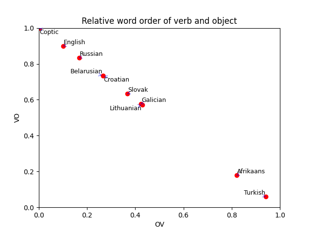

# Relative word order 

The languages I chose to compare are Coptic, English, Russian, Belarusian, Croation, Slovak, Galician, Lithuanian, Afrikaans, and Turkish. I was slightly surprised at the close similarity between Belarusian and Croatian, but not Croatian and Slovak. Based on geographic circumstances, I would have expected it to go the other way. 

